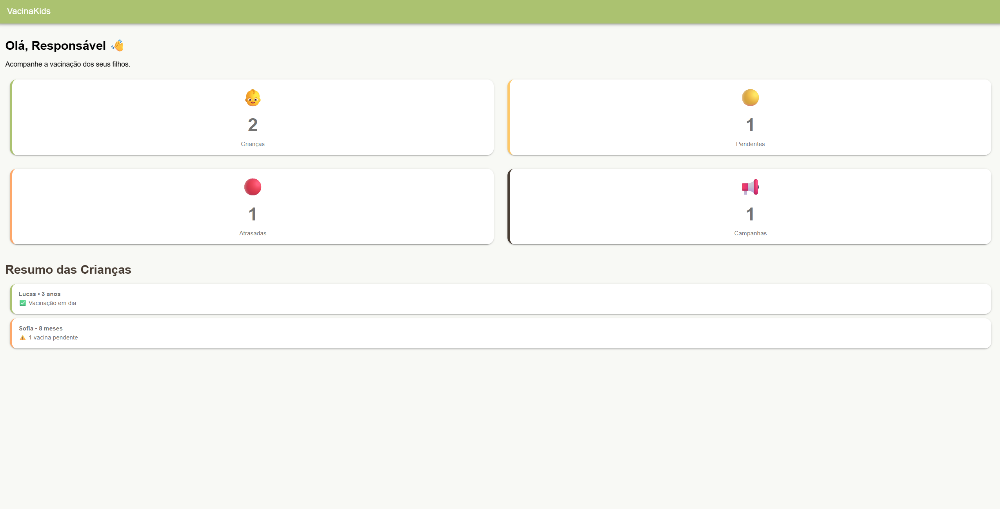
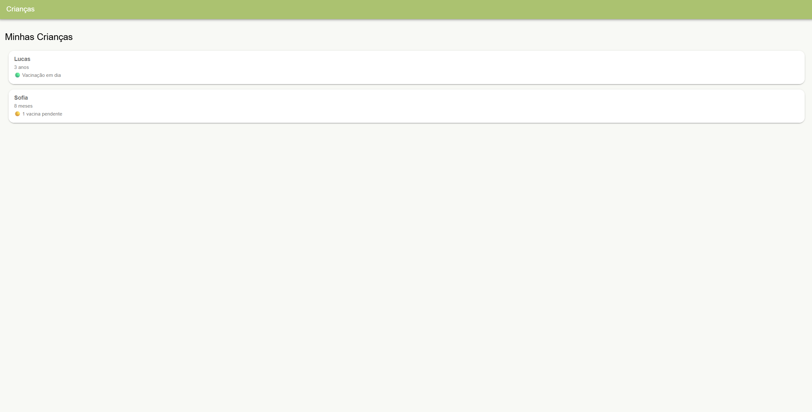
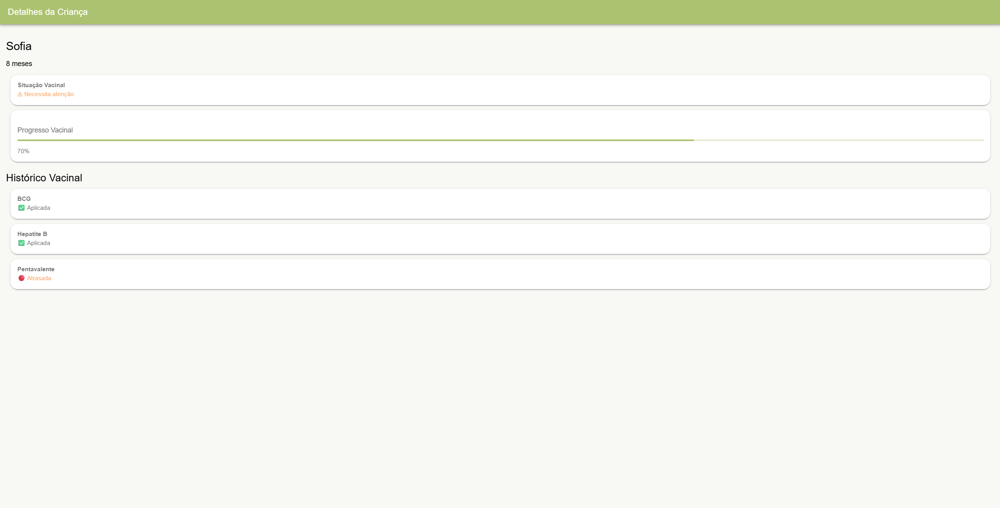

# VacinaKids 💉

## 🔗 Links

- Repositório: https://github.com/Kalleb-Mira/vacina-kids
- Aplicação: https://vacina-kids-eight.vercel.app/

Aplicação desenvolvida com Angular e Ionic para auxiliar pais e responsáveis no acompanhamento da vacinação infantil.

##  Sobre o Projeto

O VacinaKids foi criado como solução para facilitar o acompanhamento da jornada de vacinação das crianças, permitindo visualizar o histórico vacinal, identificar pendências e acompanhar campanhas de vacinação de forma simples e intuitiva.

##  Funcionalidades

- Dashboard com indicadores vacinais
- Acompanhamento de múltiplas crianças
- Histórico de vacinação por criança
- Identificação de vacinas aplicadas
- Identificação de vacinas pendentes
- Identificação de vacinas atrasadas
- Visualização de campanhas de vacinação ativas
- Navegação responsiva para desktop e dispositivos móveis

##  Cenários Atendidos

### Cenário 1
Visualização das vacinas já realizadas e das vacinas pendentes para cada criança.

### Cenário 2
Identificação de vacinas com data prevista ultrapassada.

### Cenário 3
Exibição de campanhas de vacinação ativas.

### Cenário 4
Acompanhamento individual de múltiplas crianças com históricos distintos.

## 📸 Screenshots

### Dashboard



### Lista de Crianças



### Detalhes da Criança




## 🛠 Tecnologias Utilizadas

- Angular 21
- Ionic Framework
- TypeScript
- SCSS

##  Paleta de Cores

- #ABC270
- #FEC868
- #FDA769
- #473C33

## 🚀 Como Executar o Projeto

### Instalar dependências

```bash
npm install
```

### Executar em ambiente de desenvolvimento

```bash
ionic serve
```

### Gerar build de produção

```bash
npm run build
```

## 📂 Estrutura do Projeto

```text
src/
├── dashboard/
├── children/
├── child-details/
├── campaigns/
├── app.routes.ts
```

## 🌐 Deploy

Aplicação publicada na Vercel.

## 👨‍💻 Autor

Kalleb Alves Mira

Desenvolvedor Full Stack Jr.
